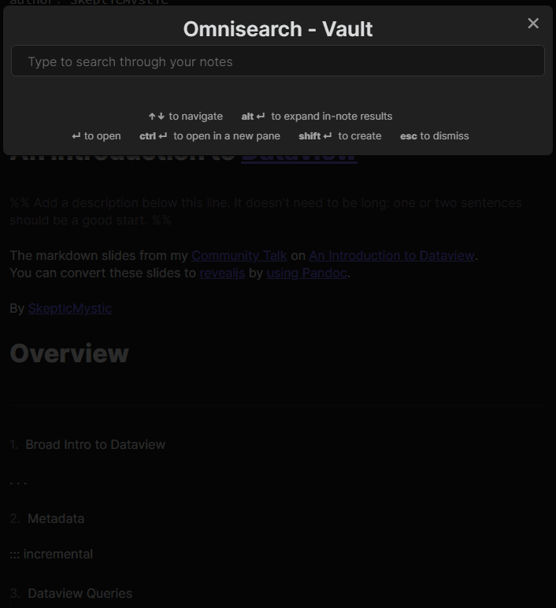

# Omnisearch for Obsidian

_**This plugin is in an early beta state.** It's usable, but things may break, features are missing, configuration is non-existent, etc._

_If you experience what you consider to be a bug or performance problem, please [open an issue](https://github.com/scambier/obsidian-omnisearch/issues)._

---

**Omnisearch** is a search engine that "_just works_". Type what you're looking for, and it will instantly show you the most relevant results.

Under the hood, it uses the excellent [MiniSearch](https://github.com/lucaong/minisearch) library.

## Installation & Usage

Omnisearch is not yet available on the official community plugins repository. You can either:

- Install it through [BRAT](https://github.com/TfTHacker/obsidian42-brat)
- Or download the `scambier.obsidian-omnisearch-x.y.z.zip` file from the [releases page](https://github.com/scambier/obsidian-omnisearch/releases) and unzip it in your `.obsidian/plugins` folder. You'll have to update it manually, though.

Once activated, you can access Omnisearch through the Command Palette by looking for "Omnisearch". You can also assign it a keybind for faster access. The Omnisearch modal works like the Quick Switch plugin: just type your query, navigate with the arrows, and open the note with Enter.

## Features

- Automatic document scoring using the [BM25 algorithm](https://github.com/lucaong/minisearch/issues/129#issuecomment-1046257399)
  - The relevance of a document against a query depends on the number of times the query terms appear in the document, its filename, and its headings
- Instant search results, with highlighting
- Fuzzy/partial search, resistance to typos

### In the works

- UI to show multiple matches in the same note
- Search in open notes
- Settings to ignore folders 
- Settings to configure the weighting variables

## Motivation

Obsidian works best with a well-organized vault, but most of my notes are unrelated tidbits of knowledge and code snippets, without tags, links, of even folders.

I want (_need_) a fast and easy way to search my notes, something that _**just works**_. That's what Omnisearch is.

Since I like to favor "search over organization", I wanted to make a search interface that would be useful for me.

## LICENSE

Omnisearch is licensed under [GPL-3](https://tldrlegal.com/license/gnu-general-public-license-v3-(gpl-3)).