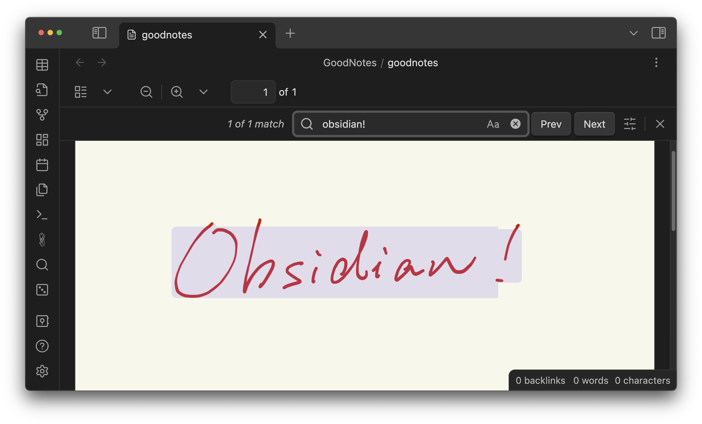
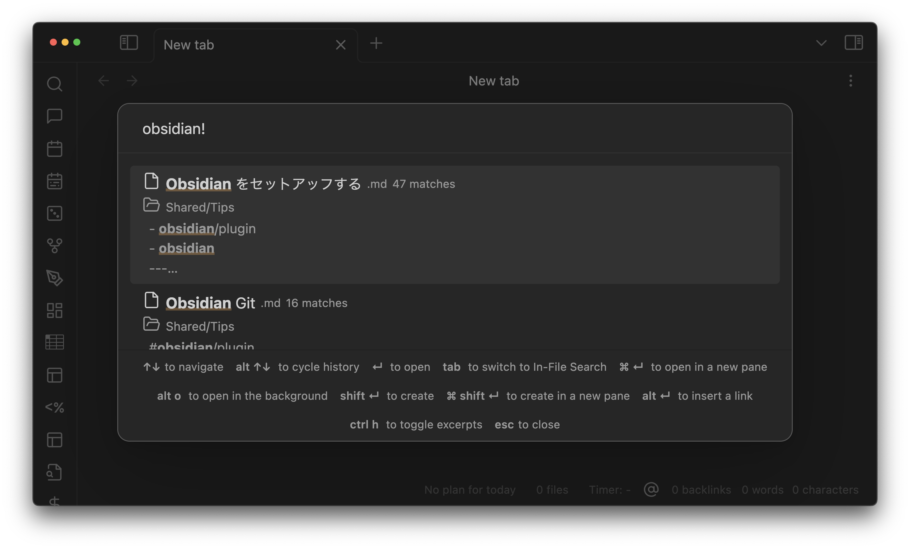
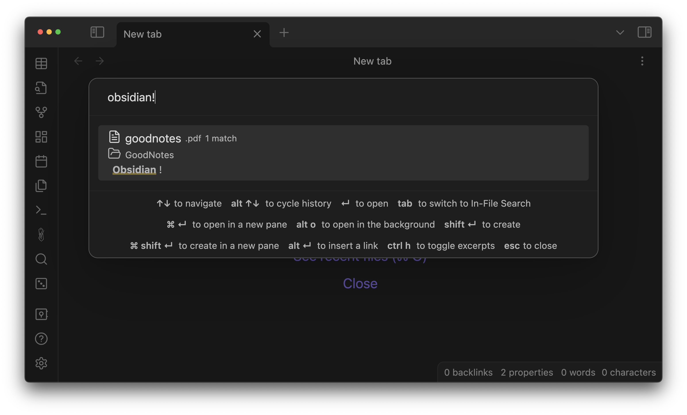

# Obsidian Omnisearch with better PDF text extraction

This is a little bit modified version of the awesome [Obsidian Omnisearch plugin](https://github.com/scambier/obsidian-omnisearch). A big-up to the original authoer @scambier.

The only modification I made is the PDF text extraction.
The original implementation uses the [Text Extractor](https://github.com/RyotaUshio/obsidian-text-extractor/tree/master) plugin for this purpose, but I found sometimes it didn't work as expected, especially for handwritten notes exported from [GoodNotes](https://www.goodnotes.com/).

These notes already have embeded text generated by the great OCR ability of GoodNotes, and this text is searchable by the built-in search of Obsidian's PDF viewer, as shown below.



However, the original version of Omnisearch can't find it.



So here's where this fork comes in. It can easily locate the handwritten text!



## Installation

After uninstalling the original Omnisearch, run the following:

```
cd <your vault's root>/.obsidian/plugins
git clone https://github.com/RyotaUshio/obsidian-omnisearch.git omnisearch
cd omnisearch
npm i
npm run build
cp dist/main.js .
```
