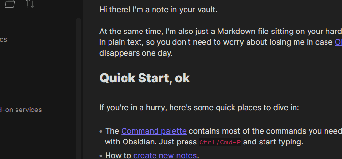

# Omnisearch for Obsidian

_**This plugin is in an early beta state.** It's usable, but things may break, features are missing, configuration is non-existent, etc._

_If you experience what you consider to be bug or performance problem, please [open an issue](https://github.com/scambier/obsidian-omnisearch/issues)._

---

**Omnisearch** aims to provide a fast, unobtrusive, and "intelligent" search interface for Obsidian. Under the hood, it uses the excellent [MiniSearch](https://github.com/lucaong/minisearch) library.

## Installation

Omnisearch is not yet available on the official community plugins repository.

## Features

- Automatic document scoring using the [BM25 algorithm](https://github.com/lucaong/minisearch/issues/129#issuecomment-1046257399). 
  - Your notes are split into different fields (filename, title, body) that are weighted differently to sort the results.
- Get results as you type
- Highlight matching query terms
- Fuzzy/partial search, resistance to typos

## Motivation

Obsidian works best with a well-organized vault, but most of my notes are unrelated tidbits of knowledge and code snippets, without tags, links, of even folders.

Since I like to favor "search over organization", I wanted to make a search interface that would be useful for me.